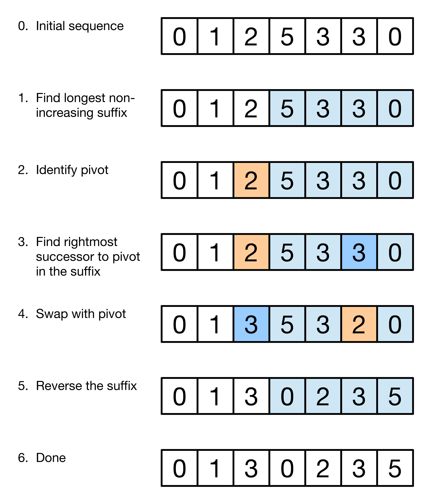

Permutation algorithm
=======
Next permutation is a process that rearranges numbers into the lexicographically next greater permutation of numbers. After several submissions and the clear and beautiful explanation in [link to Project Nayuki!](https://www.nayuki.io/page/next-lexicographical-permutation-algorithm), I think I've completely understood this algorithm. Here is my thoughts (may have some repeat thoughts with Nayuki's). Also use the example and image in Nayuki's post.

## Algorithms

## Previous Permutation
