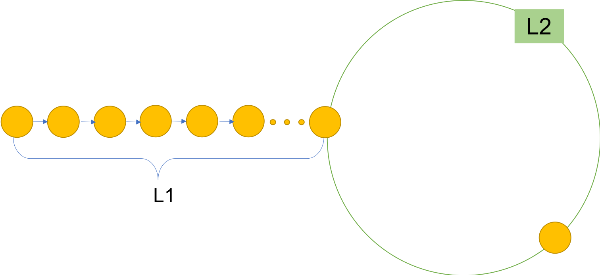

Explanation and thoughts of Linked List Cycle
=======

This set of problems are trying to find if there is a cycle in a linked list, and
find out where is the start of the cycle and other related problems. There are two
ways to handle this problem.

In the following picture, L1 is the distance from head to the start of cycle. C is the length of the cycle and L2 is the distance from the start of the cycle to the meeting location of two pointers which will be used in Method 2.

## Hash set (One pointer)
Hash set created a set for visited locations and the first point which is already in the set is the start of the cycle. And until now, the pointer moves N steps. If the point is None, then there is no cycle in the List.

Mark the start point, and move from the head, when you reach the start point, you get L1. And C = N - L1.

In this method, we'll use extra space for hash set. The time complexity is O(N), where N is count of all unique points in the list.  

---

## Two pointers

Use two pointers fast and slow. Faster moves two steps every time while slow moves only one step (why is two?). If there is a cycle in the list, the fast and slow point will finally meet. If there isn't a cycle, fast point will be none in the end.

Assume that before the meeting, fast has moved **p**  cycles and slow has move **q** cycles. And the moving loop has been called **n** times. There are the following relationships:

1. For slow pointer, n = L1 + L2 + c * q
2. For fast pointer, 2n = L1 - 1 + L2 + c * p (-1 if the fast point start at the head's next)

According to these two relationships:

              2*n = 2* (L1 + L2 + c * q) = L1 - 1 + L2 + c * p

Do simple simplification, we can get:

              L1 = (p - 2 * q + 1) * C + (C - (L2 + 1))

In this equation, (p - 2 * q + 1) * C means rounding the cycle several times. And (C - (L2 + 1)) means the distance from the next point of meeting point to the start of the cycle. L1 represents the distance from head to the start of the cycle.

So we can use two pointers again but with same step length. One moves from the head and the other moves from the next point of meeting point. The location they meet is the start of the cycle.

This is a very amazing method which doesn't use extra space and complexity is also O(N). 
