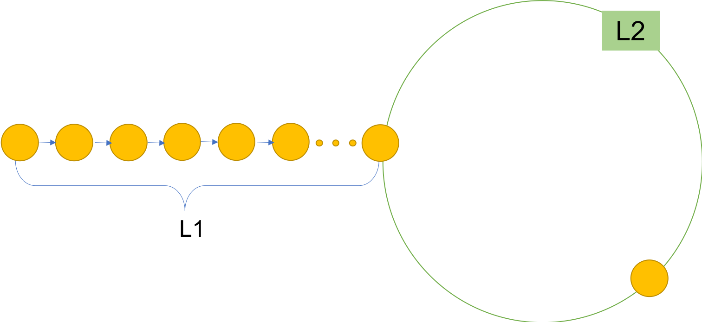

Explanation and thoughts of Linked List Cycle
=======

This set of problems are trying to find if there is a cycle in a linked list, and
find out where is the start of the cycle and other related problems. There are two
ways to handle this problem.

## Hash set

Paragraphs are separated
by a blank line.

Two spaces at the end of a line  
produces a line break.

## Two pointers

Text attributes _italic_,
**bold**, `monospace`.

Horizontal rule:

---

Bullet list:

  * apples
  * oranges
  * pears

Numbered list:

  1. wash
  2. rinse
  3. repeat

A [link][example].

  [example]: http://example.com

> Markdown uses email-style > characters for blockquoting.

Inline <abbr title="Hypertext Markup Language">HTML</abbr> is supported.
